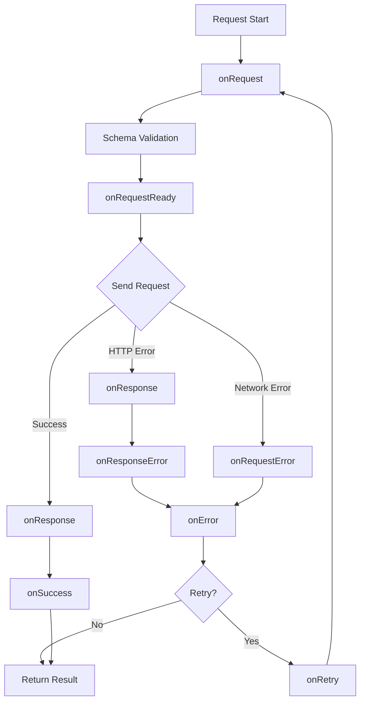

## Overview

CallApi provides comprehensive lifecycle hooks that let you intercept and customize every stage of the request/response cycle. Hooks are asynchronous functions that receive context about the current request.

## Available Hooks

CallApi provides 11 lifecycle hooks organized by execution stage:

### Request Lifecycle

<CardGroup cols={2}>

<Card title="onRequest" icon="paper-plane">
Called before the HTTP request is sent. Modify request headers, add authentication, or log requests.

Source: [hooks.ts:32-44](~/workspace/source/packages/callapi/src/hooks.ts)
</Card>

<Card title="onRequestReady" icon="check">
Called after request processing, just before sending. Final chance to inspect the request.

Source: [hooks.ts:59-63](~/workspace/source/packages/callapi/src/hooks.ts)
</Card>

<Card title="onRequestStream" icon="signal-stream">
Called during upload progress tracking. Useful for progress bars.

Source: [hooks.ts:65-76](~/workspace/source/packages/callapi/src/hooks.ts)
</Card>

<Card title="onRequestError" icon="circle-exclamation">
Called when network-level errors occur (timeouts, connection failures).

Source: [hooks.ts:47-56](~/workspace/source/packages/callapi/src/hooks.ts)
</Card>

</CardGroup>

### Response Lifecycle

<CardGroup cols={2}>

<Card title="onResponse" icon="reply">
Called for all HTTP responses, regardless of status code.

Source: [hooks.ts:78-89](~/workspace/source/packages/callapi/src/hooks.ts)
</Card>

<Card title="onSuccess" icon="circle-check">
Called for successful responses (2xx status codes).

Source: [hooks.ts:129-140](~/workspace/source/packages/callapi/src/hooks.ts)
</Card>

<Card title="onResponseError" icon="triangle-exclamation">
Called for HTTP error responses (4xx, 5xx status codes).

Source: [hooks.ts:91-101](~/workspace/source/packages/callapi/src/hooks.ts)
</Card>

<Card title="onResponseStream" icon="download">
Called during download progress tracking. Useful for progress bars.

Source: [hooks.ts:103-114](~/workspace/source/packages/callapi/src/hooks.ts)
</Card>

</CardGroup>

### Error & Retry Lifecycle

<CardGroup cols={2}>

<Card title="onError" icon="bug">
Unified error handler for all error types (network, HTTP, validation).

Source: [hooks.ts:22-32](~/workspace/source/packages/callapi/src/hooks.ts)
</Card>

<Card title="onValidationError" icon="shield-xmark">
Called when request/response validation fails.

Source: [hooks.ts:142-153](~/workspace/source/packages/callapi/src/hooks.ts)
</Card>

<Card title="onRetry" icon="rotate-right">
Called before each retry attempt.

Source: [hooks.ts:116-127](~/workspace/source/packages/callapi/src/hooks.ts)
</Card>

</CardGroup>

## Hook Context Types

Each hook receives a context object with relevant information:

### RequestContext

Available in: `onRequest`, `onRequestReady`, `onRequestStream`

```typescript
interface RequestContext {
  baseConfig: BaseCallApiConfig;  // Base configuration
  config: CallApiConfig;           // Instance configuration
  options: CallApiExtraOptions;    // Merged options
  request: CallApiRequestOptions;  // Mutable request object
}
```

Source: [hooks.ts:177-213](~/workspace/source/packages/callapi/src/hooks.ts)

### SuccessContext

Available in: `onSuccess`

```typescript
interface SuccessContext extends RequestContext {
  data: TData;        // Parsed response data
  response: Response; // HTTP response object
}
```

Source: [hooks.ts:223-227](~/workspace/source/packages/callapi/src/hooks.ts)

### ErrorContext

Available in: `onError`, `onRequestError`, `onResponseError`, `onValidationError`

```typescript
interface ErrorContext extends RequestContext {
  error: HTTPError | ValidationError | Error;
  response: Response | null; // Available for HTTP errors
}
```

Source: [hooks.ts:251-255](~/workspace/source/packages/callapi/src/hooks.ts)

### RetryContext

Available in: `onRetry`

```typescript
interface RetryContext extends ErrorContext {
  retryAttemptCount: number; // Current retry attempt
}
```

Source: [hooks.ts:263-268](~/workspace/source/packages/callapi/src/hooks.ts)

### StreamContext

Available in: `onRequestStream`, `onResponseStream`

```typescript
interface StreamContext extends RequestContext {
  event: StreamProgressEvent;
  requestInstance?: Request;  // For upload
  response?: Response;        // For download
}

interface StreamProgressEvent {
  loaded: number;   // Bytes transferred
  total: number;    // Total bytes
  progress: number; // Percentage (0-100)
}
```

Source: [hooks.ts:270-282](~/workspace/source/packages/callapi/src/hooks.ts)

## Basic Usage

### Global Hooks

Define hooks in the base configuration:

```typescript
import { createFetchClient } from 'callapi';

const callApi = createFetchClient({
  baseURL: 'https://api.example.com',
  
  // Called before every request
  onRequest: ({ request, options }) => {
    console.log(`Making request to: ${options.fullURL}`);
  },
  
  // Called for successful responses
  onSuccess: ({ data, response }) => {
    console.log('Request succeeded:', response.status);
  },
  
  // Called for error responses
  onError: ({ error, response }) => {
    console.error('Request failed:', error.message);
  },
});
```

### Per-Request Hooks

Override or extend hooks for specific requests:

```typescript
const { data } = await callApi('/users', {
  onRequest: ({ request }) => {
    console.log('Custom request hook');
  },
  
  onSuccess: ({ data }) => {
    console.log('Got user data:', data);
  },
});
```

## Common Use Cases

### Authentication

Add authentication headers:

```typescript
const callApi = createFetchClient({
  baseURL: 'https://api.example.com',
  
  onRequest: async ({ request }) => {
    const token = await getAuthToken();
    request.headers.Authorization = `Bearer ${token}`;
  },
});
```

### Request Logging

Log all requests with timing:

```typescript
const callApi = createFetchClient({
  baseURL: 'https://api.example.com',
  
  onRequest: ({ options }) => {
    console.log(`[${new Date().toISOString()}] ${options.fullURL}`);
  },
  
  onSuccess: ({ response, options }) => {
    const duration = performance.now() - options.meta?.startTime;
    console.log(`✓ ${options.fullURL} (${duration}ms)`);
  },
});
```

### Error Tracking

Send errors to a tracking service:

```typescript
import * as Sentry from '@sentry/browser';

const callApi = createFetchClient({
  baseURL: 'https://api.example.com',
  
  onError: ({ error, options, request }) => {
    Sentry.captureException(error, {
      tags: {
        url: options.fullURL,
        method: request.method,
      },
      extra: {
        requestId: options.meta?.requestId,
      },
    });
  },
});
```

### Upload Progress

Track file upload progress:

```typescript
const fileInput = document.querySelector('input[type="file"]');
const progressBar = document.querySelector('.progress-bar');

const formData = new FormData();
formData.append('file', fileInput.files[0]);

await callApi('/upload', {
  method: 'POST',
  body: formData,
  
  onRequestStream: ({ event }) => {
    progressBar.style.width = `${event.progress}%`;
    console.log(`Uploaded: ${event.loaded} / ${event.total}`);
  },
});
```

### Download Progress

Track file download progress:

```typescript
const { data } = await callApi('/download/large-file.zip', {
  responseType: 'blob',
  
  onResponseStream: ({ event }) => {
    updateProgressBar(event.progress);
    
    console.log(
      `Downloaded: ${(event.loaded / 1024 / 1024).toFixed(2)} MB / ` +
      `${(event.total / 1024 / 1024).toFixed(2)} MB`
    );
  },
});
```

### Retry Logging

Log retry attempts:

```typescript
const callApi = createFetchClient({
  baseURL: 'https://api.example.com',
  retryAttempts: 3,
  
  onRetry: ({ error, retryAttemptCount, options }) => {
    console.warn(
      `Retry ${retryAttemptCount} for ${options.fullURL}`,
      `Reason: ${error.message}`
    );
  },
});
```

### Response Caching

Cache successful responses:

```typescript
const cache = new Map();

const callApi = createFetchClient({
  baseURL: 'https://api.example.com',
  
  onRequest: ({ options }) => {
    const cached = cache.get(options.fullURL);
    if (cached && Date.now() - cached.timestamp < 60000) {
      // Return cached data if less than 1 minute old
      throw new CacheHitError(cached.data);
    }
  },
  
  onSuccess: ({ data, options }) => {
    cache.set(options.fullURL, {
      data,
      timestamp: Date.now(),
    });
  },
});
```

### Validation Error Handling

Show user-friendly validation messages:

```typescript
import { toast } from './toast';

const callApi = createFetchClient({
  baseURL: 'https://api.example.com',
  
  onValidationError: ({ error }) => {
    const messages = error.issues.map(issue => issue.message);
    
    toast.error({
      title: `Invalid ${error.issueCause}`,
      message: messages.join(', '),
    });
  },
});
```

## Hook Arrays

Register multiple functions for the same hook:

```typescript
const callApi = createFetchClient({
  baseURL: 'https://api.example.com',
  
  // Multiple hooks executed in order
  onRequest: [
    ({ request }) => {
      // Add authentication
      request.headers.Authorization = getToken();
    },
    ({ request, options }) => {
      // Add request ID
      request.headers['X-Request-ID'] = generateId();
    },
    ({ options }) => {
      // Log request
      logger.info(`Request to ${options.fullURL}`);
    },
  ],
});
```

Source: [hooks.ts:156-161](~/workspace/source/packages/callapi/src/hooks.ts)

## Hook Execution Modes

Control how multiple hooks execute:

```typescript
const callApi = createFetchClient({
  baseURL: 'https://api.example.com',
  
  // Execute hooks in parallel (default)
  hooksExecutionMode: 'parallel',
  
  onRequest: [
    async () => { /* Hook 1 */ },
    async () => { /* Hook 2 */ },
    async () => { /* Hook 3 */ },
  ],
});
```

<Accordion title="Execution Modes">

**parallel** (default)

All hooks execute simultaneously using `Promise.all()`. Provides better performance but hooks cannot depend on each other's results.

```typescript
hooksExecutionMode: 'parallel'
```

**sequential**

Hooks execute one by one in registration order. Use when hooks depend on each other.

```typescript
hooksExecutionMode: 'sequential',

onRequest: [
  async ({ request }) => {
    // Hook 1: Get token
    const token = await fetchToken();
    request.headers.Authorization = `Bearer ${token}`;
  },
  async ({ request }) => {
    // Hook 2: Depends on token from Hook 1
    const permissions = await validateToken(
      request.headers.Authorization
    );
    request.headers['X-Permissions'] = permissions;
  },
]
```

Source: [hooks.ts:163-175](~/workspace/source/packages/callapi/src/hooks.ts)

</Accordion>

## Advanced Patterns

### Conditional Hooks

Execute hooks based on conditions:

```typescript
const callApi = createFetchClient({
  baseURL: 'https://api.example.com',
  
  onRequest: ({ options, request }) => {
    // Only add auth for protected routes
    if (options.fullURL.includes('/protected/')) {
      request.headers.Authorization = getToken();
    }
    
    // Only log in development
    if (process.env.NODE_ENV === 'development') {
      console.log('Request:', options.fullURL);
    }
  },
});
```

### Hook Composition

Create reusable hook factories:

```typescript
// Hook factory for authentication
function createAuthHook(getToken: () => Promise<string>) {
  return async ({ request }: RequestContext) => {
    const token = await getToken();
    request.headers.Authorization = `Bearer ${token}`;
  };
}

// Hook factory for logging
function createLoggerHook(logger: Logger) {
  return ({ options }: RequestContext) => {
    logger.info(`Request to ${options.fullURL}`);
  };
}

// Compose hooks
const callApi = createFetchClient({
  baseURL: 'https://api.example.com',
  onRequest: [
    createAuthHook(getAuthToken),
    createLoggerHook(myLogger),
  ],
});
```

### Abort Requests

Cancel requests from hooks:

```typescript
const callApi = createFetchClient({
  baseURL: 'https://api.example.com',
  
  onRequest: ({ request, options }) => {
    // Cancel if user is offline
    if (!navigator.onLine) {
      request.signal?.abort();
      throw new Error('Device is offline');
    }
    
    // Cancel if cache hit
    const cached = getFromCache(options.fullURL);
    if (cached) {
      request.signal?.abort();
      return cached;
    }
  },
});
```

### Modify Response Data

Transform response data in hooks:

```typescript
const callApi = createFetchClient({
  baseURL: 'https://api.example.com',
  
  onSuccess: ({ data }) => {
    // Normalize data structure
    if (Array.isArray(data)) {
      return data.map(normalizeItem);
    }
    return normalizeItem(data);
  },
});
```

<Warning>
Modifying the returned value from hooks does not change the actual response data. Use response transformers or middleware for that purpose.
</Warning>

## Best Practices

<AccordionGroup>

<Accordion title="Keep Hooks Fast">

Hooks execute in the critical request path. Avoid slow operations:

```typescript
// ❌ Bad: Slow operation in hook
onRequest: async ({ request }) => {
  // This delays every request!
  await slowDatabaseQuery();
  request.headers['X-Data'] = result;
}

// ✅ Good: Fast operation
onRequest: ({ request }) => {
  request.headers['X-Request-ID'] = generateId();
}
```

</Accordion>

<Accordion title="Handle Errors Gracefully">

Don't let hook errors crash your app:

```typescript
onRequest: ({ request }) => {
  try {
    request.headers.Authorization = getToken();
  } catch (error) {
    console.error('Failed to get token:', error);
    // Continue without auth
  }
}
```

</Accordion>

<Accordion title="Use Type Safety">

Leverage TypeScript for type-safe hooks:

```typescript
import type { RequestContext } from 'callapi';

const authHook = ({ request }: RequestContext) => {
  // TypeScript knows the shape of request
  request.headers.Authorization = getToken();
};

const callApi = createFetchClient({
  onRequest: authHook,
});
```

</Accordion>

<Accordion title="Avoid Side Effects">

Be careful with mutations:

```typescript
// ✅ Good: Modify request headers
onRequest: ({ request }) => {
  request.headers['X-Custom'] = 'value';
}

// ⚠️ Caution: External side effects
onRequest: ({ options }) => {
  // This modifies external state
  globalRequestCounter++;
  localStorage.setItem('lastRequest', options.fullURL);
}
```

</Accordion>

</AccordionGroup>

## Hook Execution Order



<Note>
Hooks are called in the order they are registered. Plugin hooks execute before base config hooks, which execute before per-request hooks.
</Note>
